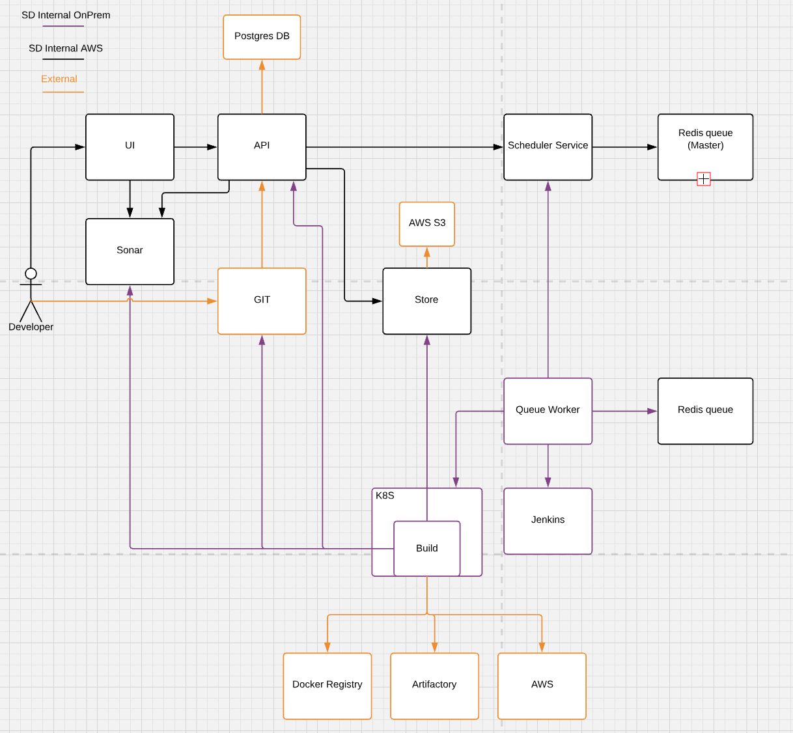

# Multiple Build Cluster 

## Context

Build a scalable Screwdriver build infrastructure. 

## Objective 

1. Running builds in parallel with help of multiple build clusters.
2. Users can bring in their own build clusters for their own specific infrastructure needs.
3. Support build cluster in AWS

## Proposal

1. Implicit build clusters
	Screwdriver maintains its own multiple build cluster infrastructure.

2. Explicit build clusters
	Users can bring in their own build cluster infrastructure. 

As part of cluster onboarding process for above both options cluster admin should register their build cluster information with Screwdriver. Below details are required to register a build cluster.
	1. Cluster name
	2. Status - cluster status
	3. Queue name
	4. Authorization (initial phase will support JWT with key and sign options)
	5. SCM Organization
	6. SCM Context
	7. Managed (Screwdriver / External) 

Multiple build cluster onboarding process doc 
	TBD

## Design

### Scheduler service will be responsible 
	1. identify build cluster and queue information for a build and queue jobs in respective queues.

	2. authorize queue worker from build cluster and allow only authorized jobs from queues wrto build cluster.

### Authorization
Initial phase, we will go with JWT + private and public key authorization. Token expiry will be passed as part of signOption. Periodically cycle private+public key and signOption which has the expiry interval, and this will be a manual step which needs to be co-ordinated between Build cluster admin and Screwdriver team.

#### New table for build cluster details
Table: `buildClusters`

Columns:
| Name | Type | Nullable | Primary Key | Unique | Description
| --- | --- | --- | --- | --- | --- |
| `id` | integer | no | yes | yes | |
| `name` | text (100) | no | no | yes | |
| `scmOrganization` | text(200) | no | no | no | |
| `scmContext` | text(200) | no | no | no | |
| `isActive` | boolean | no | no | no | *0-false or 1-true* |
| `authKeyFileName` | text(100) | no | no | yes | *hash and store the public key filename* |
| `signOptionFileName` | text(100) | no | no | yes | *hash and store signOption filename { issuer: , subject: , audience: , expires: , algorithm: }* |
| `queue` | text(100) | no | no | no | |
| `managedBy` | text(50) | no | no | no | cluster managed by *screwdriver or external* |

### Cache 
	Use Redis HMSET to cache all active records from `buildClusters` table. Redis should be updated for any changes in `buildClusters` table.
		HMSET <cluster_name> authKeyName "filename" signOption "{value}" queue "value" managedBy "screwdriver"
		HGET <cluster_name> authKeyName
		HGET <cluster_name> signOption

#### Below listed apis need to be built to manage the cluster details
| --- | --- |
| `PUT` | ` /v4/buildClusters { } ` |
| `PUT` | `	/v4/buildClusters {name} ` |
| `GET` | `	/v4/buildClusters ` |
| `GET` | `	/v4/buildClusters {name} ` |
| `DELETE` | ` /v4/buildClusters {name} ` |

## Flow
### Screwdriver API to Scheduler service

	1. Screwdriver UI / PR commit / Merge triggers new build via Screwdriver API
	2. Screwdriver API inturn calls Scheduler service with appropriate build details to schedule a job
	3. Scheduler service queries `buildClusters` table for active records with cluster name from build info
	4. one (or) more record exist, then assign job to the queue ( pick the queue identified by generating a random number within given boundaries, which is the returned list size of records)
	5. no records, then query `clusters` table for active records with managedBy=screwdriver
	6. repeat step #4

### Queue worker to Scheduler service [ TBD ] 
